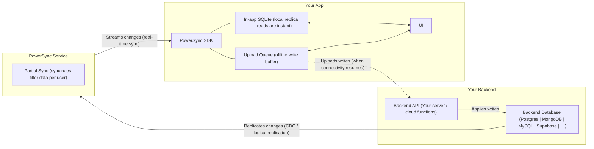

# PowerSync Skills

Best practices and expertise for building applications with PowerSync.

## Architecture

Key rule: **client writes never go through PowerSync** — they go directly from the app's upload queue to your backend API. PowerSync only handles the read/sync path.

## What to Load for Your Task

| Task | Load these files |
|------|-----------------|
| New project setup | See SDK Reference Files below for your platform |
| Handling file uploads / attachments | `references/attachments.md` |
| Setting up PowerSync with Supabase (database, auth, fetchCredentials) | `references/supabase-auth.md` |
| Debugging sync / connection issues | `references/powersync-debug.md` |
| Writing or migrating sync config | `references/sync-config.md` |
| Configuring the service / self-hosting | `references/powersync-service.md` |
| Using the PowerSync CLI | `references/powersync-cli.md` |
| Understanding the overall architecture | This file is sufficient; see `references/powersync-overview.md` for deep links |

## SDK Reference Files

### JavaScript / TypeScript

Always load `references/sdks/powersync-js.md` as the foundation for any JS/TS project, then load the applicable framework file alongside it.

| Framework file | Load when… |
|----------------|-----------|
| `references/sdks/powersync-js-react.md` | React web app or Next.js |
| `references/sdks/powersync-js-react-native.md` | React Native, Expo, or Expo Go |
| `references/sdks/powersync-js-vue.md` | Vue or Nuxt |
| `references/sdks/powersync-js-node.md` | Node.js CLI/server or Electron |
| `references/sdks/powersync-js-tanstack.md` | TanStack Query or TanStack DB (any framework) |

### Other SDKs

| File | Use when… |
|------|----------|
| `references/sdks/powersync-dart.md` | Dart / Flutter (includes Drift ORM + Flutter Web) |
| `references/sdks/powersync-dotnet.md` | .NET (MAUI, WPF, Console) |
| `references/sdks/powersync-kotlin.md` | Kotlin (Android, JVM, iOS, macOS, watchOS, tvOS) |
| `references/sdks/powersync-swift.md` | Swift / iOS / macOS (includes GRDB ORM) |

## Key Rules to Apply Without Being Asked

- **Use the CLI for instance operations** — when deploying config, generating schemas, generating dev tokens, checking status, or managing Cloud/self-hosted instances, use `powersync` CLI commands. See `references/powersync-cli.md` for usage.
- **Sync Streams over Sync Rules** — new projects must use Sync Streams (edition 3 config). Sync Rules are legacy; only use them when an existing project already has them.
- **`id` column** — never define `id` in a PowerSync table schema; it is created automatically as `TEXT PRIMARY KEY`.
- **No boolean/date column types** — use `column.integer` (0/1) for booleans and `column.text` (ISO string) for dates.
- **`connect()` is fire-and-forget** — do not `await connect()` expecting data to be ready. Use `waitForFirstSync()` if you need to wait.
- **`transaction.complete()` is mandatory** — if it is never called, the upload queue stalls permanently.
- **`disconnectAndClear()` on logout** — `disconnect()` keeps local data; `disconnectAndClear()` wipes it. Always use `disconnectAndClear()` when switching users.
- **Backend must return 2xx for validation errors** — a 4xx response from `uploadData` blocks the upload queue permanently.
