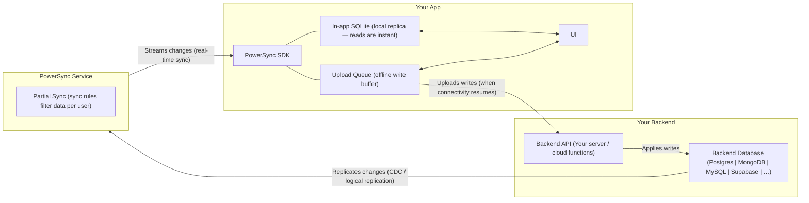

# PowerSync Skills

Best practices and expertise for building applications with PowerSync.

## Architecture



Key rule: **client writes never go through PowerSync** — they go directly from the app's upload queue to your backend API. PowerSync only handles the read/sync path.

## Getting Started — PowerSync Service Setup

When setting up the PowerSync Service, ask the user two questions if the answers aren't clear from context:
1. **Cloud or Self-hosted?** — PowerSync Cloud (managed) or self-hosted (run your own Docker instance)?
2. **Dashboard or CLI?** — For Cloud: set up via the PowerSync Dashboard UI, or via the PowerSync CLI? For Self-hosted: manual Docker setup, or use the CLI's Docker integration?

Then follow the matching path below. For all paths, also load `references/powersync-service.md` and `references/sync-config.md`.

### Path 1: Cloud — Dashboard Setup

No CLI needed. The user does everything through the [PowerSync Dashboard](https://dashboard.powersync.com).

Guide the user through these steps:

1. **Sign up and create a project** — the user needs a PowerSync account at https://dashboard.powersync.com. Once signed in, they must create a project before they can create an instance.
2. **Create a PowerSync instance** — inside the project, create a new instance.
3. **Connect the source database** — in the instance settings, add the database connection. The user needs to provide:
   - Database type (Postgres, MongoDB, MySQL, etc.)
   - Connection URI or host/port/database/username/password
   - The database must have replication enabled — see `references/powersync-service.md` → Source Database Setup for the SQL commands the user needs to run.
4. **Configure sync rules** — in the instance's Sync Config editor, write Sync Streams that define what data each user receives. Must use `config: edition: 3`. See `references/sync-config.md` for the format.
5. **Enable client authentication** — in the instance's "Client Auth" section, configure JWT verification (JWKS URI, Supabase Auth, etc.). For development, enable "Development Tokens" in this section.
6. **Get the instance URL** — copy the instance URL from the dashboard. The app's `fetchCredentials()` needs this as the PowerSync endpoint.

**IMPORTANT:** All steps must be completed. If any are missing, the app will be stuck on "Syncing..." with no data.

### Path 2: Cloud — CLI Setup

Load `references/powersync-cli.md` for full CLI reference.

**What to ask the user before starting:**
- Do they have a PowerSync account? If not, direct them to https://dashboard.powersync.com to sign up.
- Have they created a project on the dashboard? If not, they need to create one first at https://dashboard.powersync.com (a project is required before creating an instance).
- Do they have an existing instance, or should we create a new one?

#### New Cloud Instance

1. **Install and authenticate:**
   ```bash
   npm install -g powersync
   powersync login
   ```
   `powersync login` opens a browser for the user to create/paste a personal access token (PAT). If they don't have one: https://dashboard.powersync.com/account/access-tokens

2. **Scaffold config files:**
   ```bash
   powersync init cloud
   ```
   This creates `powersync/service.yaml` and `powersync/sync-config.yaml` with template values.

3. **Read the scaffolded files**, then prompt the user for their database connection details and edit the files:
   - `powersync/service.yaml` — fill in `replication.connections` with database type, host, port, database name, username, and password. For Cloud, use `password: secret: !env PS_DATABASE_PASSWORD` for credentials. See `references/powersync-service.md` for the correct YAML structure.
   - `powersync/sync-config.yaml` — must start with `config: edition: 3`, then define `streams:`. Write Sync Streams based on the app's tables. See `references/sync-config.md`.

4. **Ask the user for their project ID**, then create the instance and deploy:
   ```bash
   powersync link cloud --create --project-id=<project-id>
   # Add --org-id=<org-id> only if their token has access to multiple orgs
   powersync validate
   powersync deploy
   ```
   The user can find their project ID on the PowerSync Dashboard under their project settings or by running `powersync fetch instances`.

5. **Set up the source database** — the user must configure their database for replication. See `references/powersync-service.md` → Source Database Setup for the SQL commands. For Supabase, logical replication is already enabled but the user still needs to create the publication via the Supabase SQL Editor.

6. **Generate a dev token** for testing:
   ```bash
   powersync generate token --subject=user-test-1
   ```
   Use this token in the app's `fetchCredentials()` during development.

7. **Verify:** `powersync status` — confirm the instance is connected and replicating.

#### Existing Cloud Instance

**Ask the user for their project ID and instance ID**, then pull the config:
```bash
powersync login
powersync pull instance --project-id=<project-id> --instance-id=<instance-id>
# Add --org-id=<org-id> only if token has multiple orgs
```
The user can find these IDs on the PowerSync Dashboard or by running `powersync fetch instances`.

**WARNING:** `powersync pull instance` silently overwrites local `service.yaml` and `sync-config.yaml`. Do not run it if there are uncommitted local changes to those files.

After pulling, edit files as needed, then:
```bash
powersync validate
powersync deploy
```

### Path 3: Self-Hosted — Manual Docker Setup

No CLI needed. The user runs Docker directly with the PowerSync Service image.

1. **Set up the source database** — see `references/powersync-service.md` → Source Database Setup.

2. **Create the config file** — create a `config.yaml` with the correct structure. See `references/powersync-service.md` → Complete service.yaml Example. Key sections:
   - `replication.connections` — the database connection (**must** be nested here, not at root level)
   - `storage` — bucket storage database (MongoDB or Postgres, separate from source DB)
   - `client_auth` — JWT verification settings
   - `api.tokens` — API key for management access

3. **Run the Docker container:**
   ```bash
   docker run \
     -p 8080:80 \
     -e POWERSYNC_CONFIG_B64="$(base64 -i ./config.yaml)" \
     --network my-local-dev-network \
     --name my-powersync journeyapps/powersync-service:latest
   ```

4. **Create the sync config** — write sync rules (see `references/sync-config.md`) either inline in `config.yaml` or via the built-in dashboard at `http://localhost:8080`.

For more details on manual Docker setup, see `references/powersync-service.md`.

### Path 4: Self-Hosted — CLI with Docker

The CLI manages the Docker Compose stack for local development. Load `references/powersync-cli.md` for full CLI reference.

1. **Install the CLI and scaffold:**
   ```bash
   npm install -g powersync
   powersync init self-hosted
   ```

2. **Read the scaffolded `powersync/service.yaml`**, then prompt the user for connection details. If using `--database external`, the user needs to provide their source database URI. Otherwise the CLI provisions a local Postgres in Docker. See `references/powersync-service.md` for the YAML structure (`replication.connections`, `storage`, `client_auth`, `api.tokens`).

3. **Configure and start the Docker stack:**
   ```bash
   powersync docker configure
   # Use --database external if connecting to an existing database
   # Use --storage external if using an existing storage database
   powersync docker start
   ```

4. **Verify and generate tokens:**
   ```bash
   powersync status
   powersync generate schema --output=ts --output-path=./schema.ts
   powersync generate token --subject=user-test-1
   ```

For Docker stop/reset/cleanup commands, see `references/powersync-cli.md` → Docker section.

## What to Load for Your Task

| Task | Load these files |
|------|-----------------|
| New project setup | `references/powersync-cli.md` + `references/powersync-service.md` + `references/sync-config.md` + SDK files for your platform (see below) |
| Handling file uploads / attachments | `references/attachments.md` |
| Setting up PowerSync with Supabase (database, auth, fetchCredentials) | `references/supabase-auth.md` |
| Debugging sync / connection issues | `references/powersync-debug.md` |
| Writing or migrating sync config | `references/sync-config.md` |
| Configuring the service / self-hosting | `references/powersync-service.md` + `references/powersync-cli.md` |
| Using the PowerSync CLI | `references/powersync-cli.md` + `references/sync-config.md` |
| Understanding the overall architecture | This file is sufficient; see `references/powersync-overview.md` for deep links |

## SDK Reference Files

### JavaScript / TypeScript

Always load `references/sdks/powersync-js.md` as the foundation for any JS/TS project, then load the applicable framework file alongside it.

| Framework file | Load when… |
|----------------|-----------|
| `references/sdks/powersync-js-react.md` | React web app or Next.js |
| `references/sdks/powersync-js-react-native.md` | React Native, Expo, or Expo Go |
| `references/sdks/powersync-js-vue.md` | Vue or Nuxt |
| `references/sdks/powersync-js-node.md` | Node.js CLI/server or Electron |
| `references/sdks/powersync-js-tanstack.md` | TanStack Query or TanStack DB (any framework) |

### Other SDKs

| File | Use when… |
|------|----------|
| `references/sdks/powersync-dart.md` | Dart / Flutter (includes Drift ORM + Flutter Web) |
| `references/sdks/powersync-dotnet.md` | .NET (MAUI, WPF, Console) |
| `references/sdks/powersync-kotlin.md` | Kotlin (Android, JVM, iOS, macOS, watchOS, tvOS) |
| `references/sdks/powersync-swift.md` | Swift / iOS / macOS (includes GRDB ORM) |

## Key Rules to Apply Without Being Asked

- **Use the CLI for instance operations** — when deploying config, generating schemas, generating dev tokens, checking status, or managing Cloud/self-hosted instances, use `powersync` CLI commands. See `references/powersync-cli.md` for usage.
- **Sync Streams over Sync Rules** — new projects must use Sync Streams (edition 3 config). Sync Rules are legacy; only use them when an existing project already has them.
- **`id` column** — never define `id` in a PowerSync table schema; it is created automatically as `TEXT PRIMARY KEY`.
- **No boolean/date column types** — use `column.integer` (0/1) for booleans and `column.text` (ISO string) for dates.
- **`connect()` is fire-and-forget** — do not `await connect()` expecting data to be ready. Use `waitForFirstSync()` if you need to wait.
- **`transaction.complete()` is mandatory** — if it is never called, the upload queue stalls permanently.
- **`disconnectAndClear()` on logout** — `disconnect()` keeps local data; `disconnectAndClear()` wipes it. Always use `disconnectAndClear()` when switching users.
- **Backend must return 2xx for validation errors** — a 4xx response from `uploadData` blocks the upload queue permanently.
