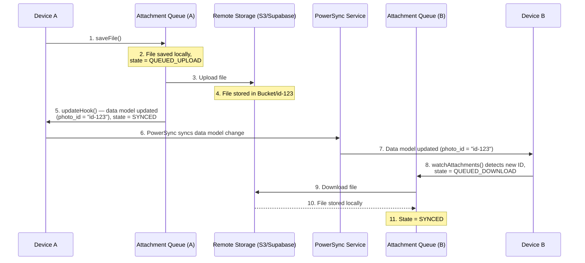

# PowerSync Attachments

> **Load this when** the app needs file uploads/downloads (images, documents, media) synced alongside PowerSync data.

## Table of Contents
- [How It Works](#how-it-works)
- [Package Setup](#package-setup)
- [Schema Setup](#schema-setup)
- [Storage Adapters](#storage-adapters)
- [Streaming Transport Adapters](#streaming-transport-adapters)
- [Initialize the Attachment Queue](#initialize-the-attachment-queue)
- [Upload / Delete / Access Files](#upload-a-file)
- [Error Handling](#error-handling)

PowerSync handles file attachments using a **metadata + storage provider** pattern: structured metadata syncs through PowerSync while actual files live in a purpose-built storage system (S3, Supabase Storage, Cloudflare R2, etc.). A local queue manages uploads, downloads, and retries automatically in the background.

| Resource | Description |
|----------|-------------|
| [Attachments docs](https://docs.powersync.com/client-sdks/advanced/attachments.md) | Full reference including migration notes and platform demos |

> **Deprecated packages:** `@powersync/attachments` (JS/TS) and `powersync_attachments_helper` (Dart/Flutter) are deprecated. Attachment functionality is now built in to the platform SDK packages. Do not install the old packages for new projects.

## How It Works



1. App calls `saveFile()` — file is written to local storage immediately, a record is inserted into the local attachments table with state `QUEUED_UPLOAD`, and the `updateHook` links the attachment ID to your data model in the same transaction.
2. The attachment queue uploads the file to remote storage in the background.
3. On upload success, the record transitions to `SYNCED`.
4. PowerSync syncs the data model change (e.g. `user.photo_id`) to other devices.
5. Those devices' `watchAttachments` query detects the new ID, creates a `QUEUED_DOWNLOAD` record, and the queue downloads the file automatically.

### Attachment States

| State | Meaning |
|-------|--------|
| `QUEUED_UPLOAD` | Saved locally, waiting to upload |
| `QUEUED_DOWNLOAD` | ID received from sync, file not yet downloaded |
| `SYNCED` | File exists locally and in remote storage |
| `QUEUED_DELETE` | Marked for deletion from both local and remote |
| `ARCHIVED` | No longer referenced in data model; candidate for cleanup |

`AttachmentState` is a **numeric enum** in the JS/TS SDKs. When checking state, compare against `AttachmentState.SYNCED` (not the string `'SYNCED'`). String comparisons never match and silently break state-gated logic.

## Package Setup

**Web / Node.js** — built in, no separate install:
```bash
# Already included in @powersync/web and @powersync/node
```

**React Native** — built in to `@powersync/react-native`, but local storage adapter requires a separate package:
```bash
# Expo
# - Expo 54+ for the storage adapter
# - Expo 56+ for streaming transport (createTransportAdapter)
npx expo install @powersync/attachments-storage-react-native expo-file-system

# Bare React Native
npm install @powersync/attachments-storage-react-native @dr.pogodin/react-native-fs
```

For streaming transport on React Native, also ensure:
- `@powersync/react-native` v2.0.3 or later
- `@powersync/attachments-storage-react-native` v0.1.0 or later

For streaming transport on Node.js, ensure `@powersync/node` v0.21.0 or later.

**Flutter/Dart, Kotlin, Swift, .NET** — built in to the respective SDK, no additional package needed.

## Schema Setup

Add `AttachmentTable` as a local-only table alongside your regular tables. It is not synced through PowerSync — it is managed entirely by the attachment queue on each device.

**JavaScript / TypeScript:**
```ts
import { Schema, Table, column, AttachmentTable } from '@powersync/web';
// or from '@powersync/react-native' / '@powersync/node'

export const AppSchema = new Schema({
  users: new Table({
    name: column.text,
    photo_id: column.text,  // FK referencing attachment ID
  }),
  attachments: new AttachmentTable(),  // local-only, managed by queue
});
```

`AttachmentTable` accepts an optional `viewName` (default: `'attachments'`). Use a custom `viewName` when migrating from the old `@powersync/attachments` package to avoid a SQLite name conflict with the legacy table.

**Dart:**
```dart
import 'package:powersync/powersync.dart';
import 'package:powersync_core/attachments/attachments.dart';

final schema = Schema([
  Table('users', [Column.text('name'), Column.text('photo_id')]),
  AttachmentsQueueTable(),
]);
```

**Kotlin / Swift** — use `createAttachmentsTable("attachments")` / `createAttachmentTable(name: "attachments")` respectively. See [SDK demos](https://docs.powersync.com/client-sdks/advanced/attachments.md#sdk--demo-reference) for full examples.

**.NET:**
```csharp
using PowerSync.Common.Attachments;
using PowerSync.Common.DB.Schema;

var users = new Table("users", new Dictionary<string, ColumnType>
{
    ["name"] = ColumnType.Text,
    ["photo_id"] = ColumnType.Text,  // FK referencing attachment ID
});

// new Table(typeof(Attachment)) uses the built-in [Table("attachments", LocalOnly = true)] attribute
var schema = new Schema(users, new Table(typeof(Attachment)));
```

## Storage Adapters

The attachment queue requires a local storage adapter and either a remote storage adapter or a transport adapter (not both).

- **`localStorage`** — reads/writes files on the local device
- **`remoteStorage`** — uploads/downloads files to/from cloud storage (receives full files as `ArrayBuffer`)
- **`transportAdapter`** — alternative to `remoteStorage` for streaming transfers; owns upload/download/delete without buffering files into memory (see [Streaming Transport Adapters](#streaming-transport-adapters))

### Local Storage Adapters (JS/TS)

```ts
// Web (IndexedDB)
import { IndexDBFileSystemStorageAdapter } from '@powersync/web';
const localStorage = new IndexDBFileSystemStorageAdapter('my-app-files');

// Node.js / Electron
import { NodeFileSystemAdapter } from '@powersync/node';
const localStorage = new NodeFileSystemAdapter('./user-attachments');

// React Native — Expo (Expo 54+)
import { ExpoFileSystemStorageAdapter } from '@powersync/attachments-storage-react-native';
const localStorage = new ExpoFileSystemStorageAdapter();

// React Native — bare
import { ReactNativeFileSystemStorageAdapter } from '@powersync/attachments-storage-react-native';
const localStorage = new ReactNativeFileSystemStorageAdapter();
```

### Remote Storage Adapter

Implement an object with `uploadFile`, `downloadFile`, and `deleteFile`. In the JS SDKs, the adapter receives the entire file as one `ArrayBuffer`. Always use signed URLs generated by your backend — never expose storage credentials to the client.

```ts
import type { AttachmentRecord } from '@powersync/web';

const remoteStorage = {
  async uploadFile(fileData: ArrayBuffer, attachment: AttachmentRecord) {
    const { uploadUrl } = await fetch('/api/attachments/upload-url', {
      method: 'POST',
      headers: { 'Content-Type': 'application/json' },
      body: JSON.stringify({ filename: attachment.filename, contentType: attachment.mediaType }),
    }).then(r => r.json());

    await fetch(uploadUrl, {
      method: 'PUT',
      body: fileData,
      headers: { 'Content-Type': attachment.mediaType ?? 'application/octet-stream' },
    });
  },

  async downloadFile(attachment: AttachmentRecord): Promise<ArrayBuffer> {
    const { downloadUrl } = await fetch(`/api/attachments/${attachment.id}/download-url`).then(r => r.json());
    return fetch(downloadUrl).then(r => r.arrayBuffer());
  },

  async deleteFile(attachment: AttachmentRecord) {
    await fetch(`/api/attachments/${attachment.id}`, { method: 'DELETE' });
  },
};
```

If you are targeting React Native or Node.js and files may be large, prefer a transport adapter instead. Buffering a large video into a JS `ArrayBuffer` can exhaust the heap on low-end devices.

## Streaming Transport Adapters

> Applies to React Native, Expo, and Node.js only.

A transport adapter replaces the remote storage adapter and transfers bytes directly between the file system and the network, without loading the file into JS memory. You provide either `remoteStorage` or `transportAdapter` in `AttachmentQueue` — TypeScript enforces the mutual exclusion.

The [`AttachmentTransportAdapter`](https://powersync-ja.github.io/powersync-js/common/interfaces/AttachmentTransportAdapter.html) interface has three methods:
- `upload(attachment)` — transfer the file at `attachment.localUri` to remote storage
- `download(attachment)` — fetch the remote file into `attachment.localUri` (the queue assigns the destination path)
- `delete(attachment)` — remove the file from remote storage

### Built-in Transports

Each streaming-capable local storage adapter exposes `createTransportAdapter`. Call it with three callbacks:

- `resolveUpload(attachment)` — return `{ url, mimeType }` for the upload HTTP request (typically a signed URL from your backend)
- `resolveDownload(attachment)` — return `{ url }` for the download HTTP request
- `deleteFile(attachment)` — perform the remote delete

```ts
import { AttachmentQueue } from '@powersync/react-native';
import { ExpoFileSystemStorageAdapter } from '@powersync/attachments-storage-react-native';

const localStorage = new ExpoFileSystemStorageAdapter();

const transportAdapter = localStorage.createTransportAdapter({
  resolveUpload: async (attachment) => ({
    url: await getSignedUploadUrl(attachment.filename),
    mimeType: attachment.mediaType ?? 'application/octet-stream',
  }),
  resolveDownload: async (attachment) => ({
    url: await getSignedDownloadUrl(attachment.filename),
  }),
  deleteFile: async (attachment) => {
    await deleteFromStorage(attachment.filename);
  },
});

const attachmentQueue = new AttachmentQueue({
  db,
  localStorage,
  transportAdapter,  // replaces remoteStorage — do not pass both
  watchAttachments: (onUpdate) => { /* ... */ },
});

await attachmentQueue.startSync();
```

Available adapters and their transport characteristics:

| Adapter | Package | Transport mechanism | Min version for transport |
|---------|---------|--------------------|--------------------------|
| `ExpoFileSystemStorageAdapter` | `@powersync/attachments-storage-react-native` | Expo native `File.upload`/`File.downloadFileAsync` | Expo 56+, `@powersync/react-native` v2.0.3, `attachments-storage-react-native` v0.1.0 |
| `ReactNativeFileSystemStorageAdapter` | `@powersync/attachments-storage-react-native` | `@dr.pogodin/react-native-fs` upload/download | `@powersync/react-native` v2.0.3, `attachments-storage-react-native` v0.1.0 |
| `NodeFileSystemAdapter` | `@powersync/node` | `fetch` with Node.js filesystem streams | `@powersync/node` v0.21.0 |

### Saving Files Already on Disk

For files the app produces on disk (camera captures, audio recordings, exports), use `saveFileFromUri` to queue the upload without reading the file into memory. This requires a streaming-capable local storage adapter (`StreamingLocalStorageAdapter` subinterface, which adds `moveFile(sourceUri, targetUri)`).

If you call `saveFile` with a blob from an on-disk file, the file is read into an `ArrayBuffer` just to write it back to disk. `saveFileFromUri` moves it into managed storage instead.

```ts
async function attachRecording(localUri: string, recordingId: string) {
  return attachmentQueue.saveFileFromUri({
    localUri,           // path to the existing file
    fileExtension: 'm4a',
    mediaType: 'audio/mp4',
    updateHook: async (tx, attachment) => {
      await tx.execute(
        'UPDATE recordings SET audio_id = ? WHERE id = ?',
        [attachment.id, recordingId]
      );
    },
  });
}
```

### Custom Transport Adapters

If the built-in transports do not cover your requirements, implement `AttachmentTransportAdapter` directly with `upload(attachment)`, `download(attachment)`, and `delete(attachment)` methods. Custom transports enable:

- **Buffer-free transfers** — transfer directly between the file system and the network, bypassing JS memory
- **Resumable transfers** — build on a resumable protocol (tus, S3 multipart) to continue from the last confirmed offset instead of restarting
- **Encryption** — encrypt before upload and decrypt after download without holding the whole file in memory

For a working reference, see the built-in [`NodeFileSystemTransportAdapter`](https://github.com/powersync-ja/powersync-js/blob/main/packages/node/src/attachments/NodeFileSystemTransportAdapter.ts).

Version requirements for custom transports: `@powersync/web` v2.2.0+, `@powersync/react-native` v2.0.3+, or `@powersync/node` v0.21.0+.

## Initialize the Attachment Queue

```ts
import { AttachmentQueue } from '@powersync/web';
// or '@powersync/react-native' / '@powersync/node'

const attachmentQueue = new AttachmentQueue({
  db,           // PowerSyncDatabase instance
  localStorage,
  remoteStorage,  // or transportAdapter — not both

  // Tell the queue which attachments your data model references.
  // Called reactively whenever watched tables change.
  watchAttachments: (onUpdate) => {
    db.watch(
      `SELECT photo_id FROM users WHERE photo_id IS NOT NULL`,
      [],
      {
        onResult: async (result) => {
          const attachments = result.rows?._array.map(row => ({
            id: row.photo_id,
            fileExtension: 'jpg',    // names the local file (<id>.jpg); not a MIME type
            mediaType: 'image/jpeg', // optional; preserved on download; never inferred from fileExtension (JS SDK only)
          })) ?? [];
          await onUpdate(attachments);
        },
      }
    );
  },

  syncIntervalMs: 30_000,       // retry interval (default: 30s)
  downloadAttachments: true,    // auto-download referenced files (default: true)
  archivedCacheLimit: 100,      // archived files to keep before cleanup (default: 100)
});

await attachmentQueue.startSync();
```

`watchAttachments` is critical: it tells the queue which files the app needs based on the current data model. The queue uses its output to decide what to download, upload, or archive. Each item must include `id` and `fileExtension`.

## Upload a File

Use `saveFile()`. The `updateHook` runs in the same database transaction as the attachment record creation, ensuring the FK in your data model and the attachment record are always written atomically.

```ts
async function uploadProfilePhoto(imageBlob: Blob, userId: string) {
  const arrayBuffer = await imageBlob.arrayBuffer();

  await attachmentQueue.saveFile({
    data: arrayBuffer,
    fileExtension: 'jpg',
    mediaType: 'image/jpeg',
    updateHook: async (tx, attachment) => {
      // Runs in the same transaction — atomic
      await tx.execute('UPDATE users SET photo_id = ? WHERE id = ?', [attachment.id, userId]);
    },
  });
}
```

For files already on disk (React Native, Node.js), use `saveFileFromUri` instead — see [Saving Files Already on Disk](#saving-files-already-on-disk).

> **Do not write the FK separately** outside of `updateHook`. Writing it in a separate `db.execute()` call after `saveFile()` breaks atomicity and can leave the data model inconsistent if the app crashes between the two writes.

## Delete a File

**Explicit delete** — use `deleteFile()` with an `updateHook` to clear the FK atomically:

```ts
await attachmentQueue.deleteFile({
  id: photoId,
  updateHook: async (tx, attachment) => {
    await tx.execute('UPDATE users SET photo_id = NULL WHERE id = ?', [userId]);
  },
});
// Queue will: delete from remote storage → delete local file → remove attachment record
```

**Passive archive** — remove the FK reference from your data model without calling `deleteFile()`. The `watchAttachments` query will no longer return the ID, so the queue automatically transitions the record to `ARCHIVED`. Once `archivedCacheLimit` is reached, archived files are deleted in order.

```ts
// Just clear the reference; the queue handles cleanup
await db.execute('UPDATE users SET photo_id = NULL WHERE id = ?', [userId]);
```

## Accessing a File

Files are only available after the attachment record reaches `SYNCED` state. Import `AttachmentState` and compare against the numeric enum value — string comparisons never match.

```ts
import { AttachmentState } from '@powersync/web';
// or '@powersync/react-native' / '@powersync/node'

// React hook example — watches for the file to become available
function useProfilePhoto(userId: string) {
  return useQuery<{ local_uri: string; state: number }>(
    `SELECT a.local_uri, a.state
     FROM users u
     LEFT JOIN attachments a ON a.id = u.photo_id
     WHERE u.id = ?`,
    [userId]
  );
}

// In your component:
const { data } = useProfilePhoto(userId);
const uri = data?.[0]?.state === AttachmentState.SYNCED ? data[0].local_uri : null;
```

For non-React targets, use `db.watch()` with the same query pattern.

**Web platform note:** On web, `local_uri` is an `indexeddb://` internal reference, not a URL the browser can load. Passing it directly to `` or `fetch()` fails with `ERR_UNKNOWN_URL_SCHEME`. Read the file through the local storage adapter and convert it to an object URL:

```ts
import { AttachmentState } from '@powersync/web';

onResult: async (result) => {
  const row = result.rows?._array[0];
  if (row?.state === AttachmentState.SYNCED && row?.local_uri) {
    const buffer = await localStorage.readFile(row.local_uri);
    const objectUrl = URL.createObjectURL(
      new Blob([buffer], { type: row.media_type ?? 'image/jpeg' })
    );
    // Use objectUrl as the . Remember to call URL.revokeObjectURL() when done.
  }
}
```

On React Native and Node.js, `local_uri` is a real file path that can be used directly (e.g. `<Image source={{ uri: localUri }} />` in React Native).

## Watching Multiple Attachment Types

**Single queue with `UNION ALL`** — simpler, but the query runs whenever any watched table changes:

```ts
watchAttachments: (onUpdate) => {
  db.watch(
    `SELECT photo_id AS id, 'jpg' AS file_extension FROM users WHERE photo_id IS NOT NULL
     UNION ALL
     SELECT document_id AS id, 'pdf' AS file_extension FROM documents WHERE document_id IS NOT NULL`,
    [],
    {
      onResult: async (result) => {
        const attachments = result.rows?._array.map(row => ({
          id: row.id,
          fileExtension: row.file_extension,
        })) ?? [];
        await onUpdate(attachments);
      },
    }
  );
},
```

Use `UNION ALL` rather than `UNION`: attachment IDs should already be unique, so deduplication is unnecessary overhead.

**Multiple queues** — each queue watches its own table with a simpler query; more memory, but independent configuration per attachment type.

## Error Handling

Return `true` to retry on the next sync interval; return `false` to archive the attachment and stop retrying.

```ts
import type { AttachmentErrorHandler } from '@powersync/web';

const errorHandler: AttachmentErrorHandler = {
  async onDownloadError(attachment, error) {
    if (error.message.includes('404')) return false; // file gone — don't retry
    return true;
  },
  async onUploadError(attachment, error) {
    return true; // always retry uploads
  },
  async onDeleteError(attachment, error) {
    return true;
  },
};

const attachmentQueue = new AttachmentQueue({ /* ... */ errorHandler });
```

## Key Rules to Apply Without Being Asked

- **`updateHook` is mandatory for atomicity** — always link the attachment ID to your data model inside `updateHook`, never in a separate write after `saveFile()` or `saveFileFromUri()`.
- **Signed URLs only** — the remote storage adapter and transport adapters must fetch signed URLs from your backend. Never embed storage credentials in the client app.
- **React Native needs a separate local storage package** — install `@powersync/attachments-storage-react-native` and the appropriate file system peer (`expo-file-system` for Expo 54+, `@dr.pogodin/react-native-fs` for bare RN).
- **`AttachmentState` is a numeric enum** (JS/TS) — compare `row.state === AttachmentState.SYNCED`, not `row.state === 'SYNCED'`. The string comparison never matches.
- **On web, `local_uri` is an `indexeddb://` reference** — do not pass it directly to `` or `fetch()`. Read it through the local storage adapter and convert to an object URL with `URL.createObjectURL()`.
- **For large files on React Native or Node.js, use a transport adapter** — pass `transportAdapter` instead of `remoteStorage`. Transport adapters stream bytes directly between the file system and the network, bypassing JS memory. `remoteStorage` and `transportAdapter` are mutually exclusive.
- **For files already on disk (React Native, Node.js), use `saveFileFromUri`** — it moves the file into managed storage without reading it into memory. `saveFile` would buffer the whole file unnecessarily.
- **`fileExtension` is required in `watchAttachments`** — each item returned by `watchAttachments` must include both `id` and `fileExtension`; the queue uses the extension to name local files (`<id>.ext`). It is not a MIME type and is never used as a Content-Type.
- **`mediaType` is optional but never inferred** (JS SDK only) — if the MIME type is known, include `mediaType` in each `watchAttachments` entry; it is used as the `Content-Type` on upload and is preserved on the downloaded record. The queue does not infer `mediaType` from `fileExtension`.
- **Check `state === AttachmentState.SYNCED` before using `local_uri`** — the record exists before the file is downloaded; accessing `local_uri` when state is `QUEUED_DOWNLOAD` points to a file that does not exist yet.
- **Migration from `@powersync/attachments`** — set a custom `viewName` on `AttachmentTable` (e.g. `'attachment_queue'`) to avoid a SQLite conflict with the legacy `attachments` table. Also update: `syncInterval` to `syncIntervalMs`, `cacheLimit` to `archivedCacheLimit`, `name` to `viewName` on `AttachmentTable`.
